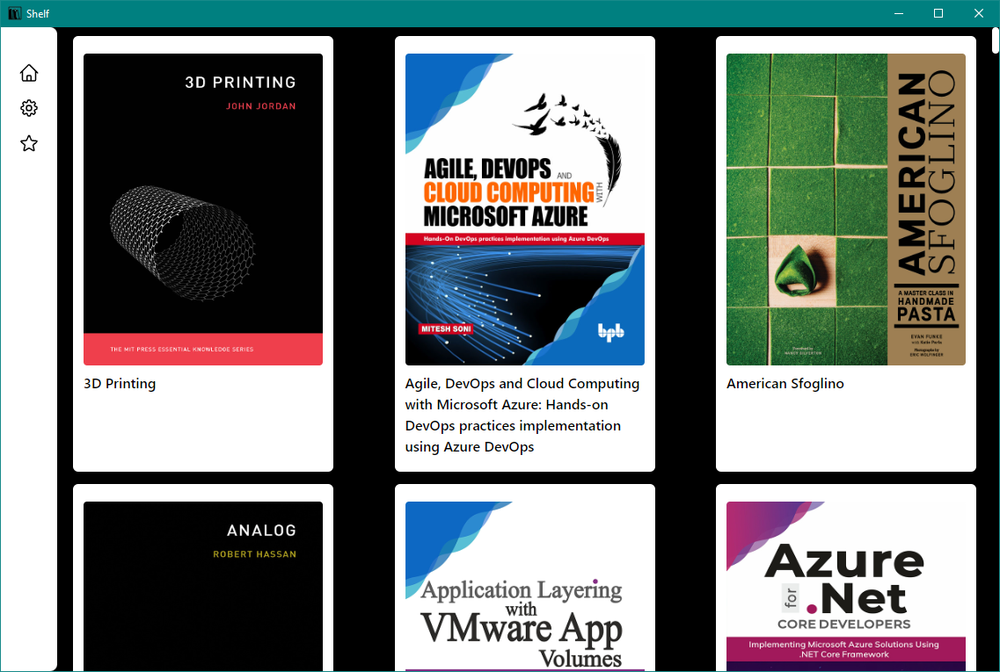
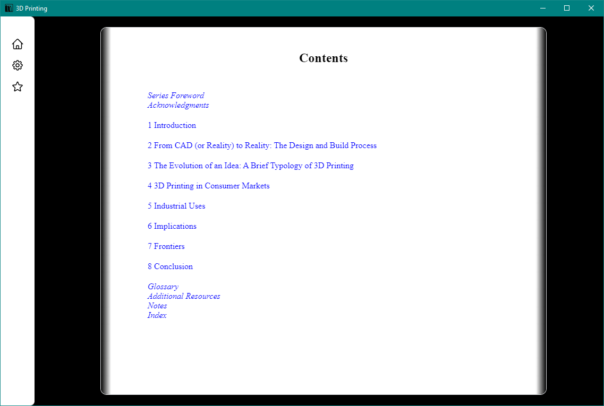

# Shelf

An eBook application written with Rust and NextJS, leveraging the Tauri framework.
The goal behind this project was to see what I can learn with NextJS and Rust; in addition to developing my project management and UI/UX skills.

## Features
* Epub support
* Infinite scrolling
* Dashboard, allowing you to view books by their covers
* Image caching
* Custom search algorithm that quickly scans for new books

## Planned
* Support for MOBI, PDF
* Ability to favourite books
* Return the user to the last page they were on
* Annotation support
* Advanced UI styling
* Support for macOS and Linux

## Building from source
* Install Node.js [v18.18.1-x64](https://nodejs.org/en/download)
* Install Rust [1.72.1](https://www.rust-lang.org/tools/install)
* Clone this repository
* Use the terminal to navigate to the projects root folder, run the following "npm install; npm run tauri dev"

## Requirements
*Check out the releases tab if you'd like to demo the application*

* ~~WebView2 (For Windows 10 1709 or older)~~ *this is bundled with the installer as of v0.1.2*
* Windows 7 or newer (Shelf has only been tested on Windows 10 but should be backward compatible)

## Preview (v0.1.1-alpha)

